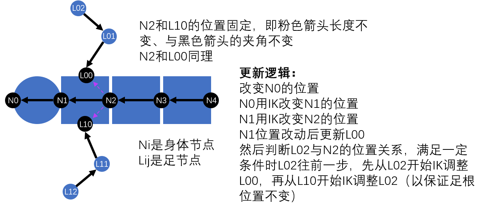

# 反向动力学蜈蚣
2025年4月19日凌晨2点12分看到[视频](https://www.bilibili.com/video/BV1h7BLYcEd1/)，觉得很好玩，于是起床后实现了一下反向动力学。

demo: https://madderscientist.github.io/codeRoad/IK/

## 原理
完全用IK（反向动力学）实现。使用的是FABRIK，基本原理见https://zhuanlan.zhihu.com/p/361520144

基本结构如下：

