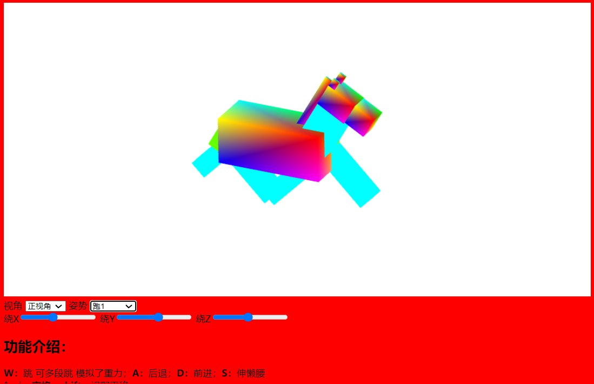
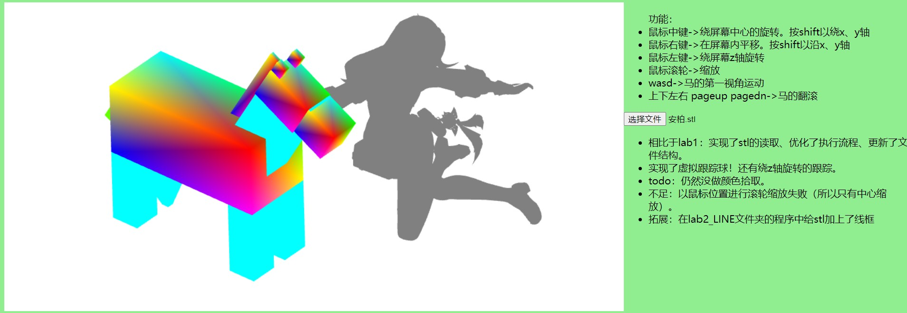
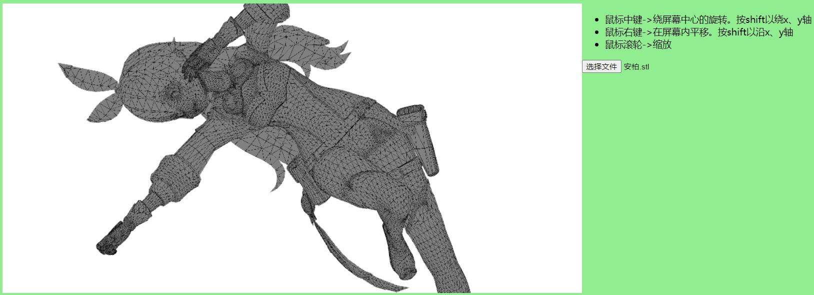
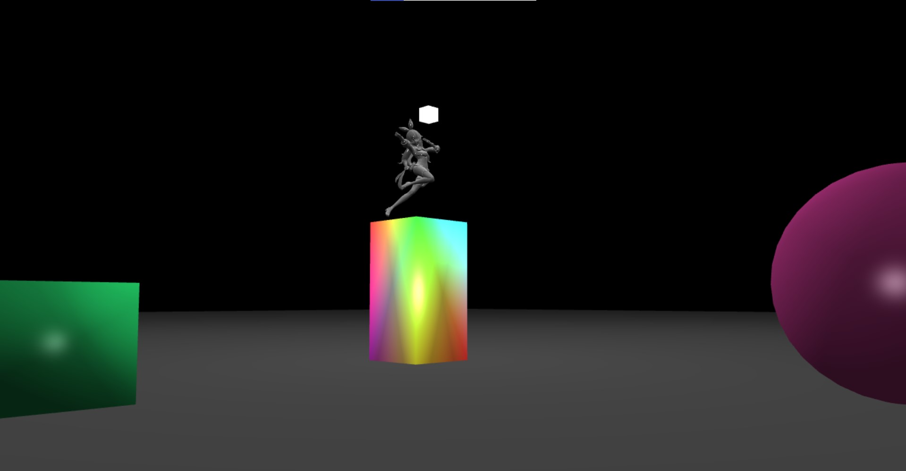
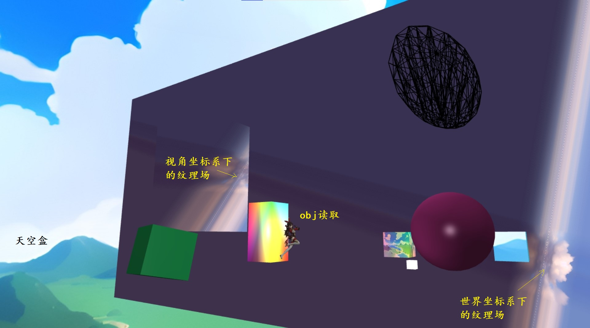
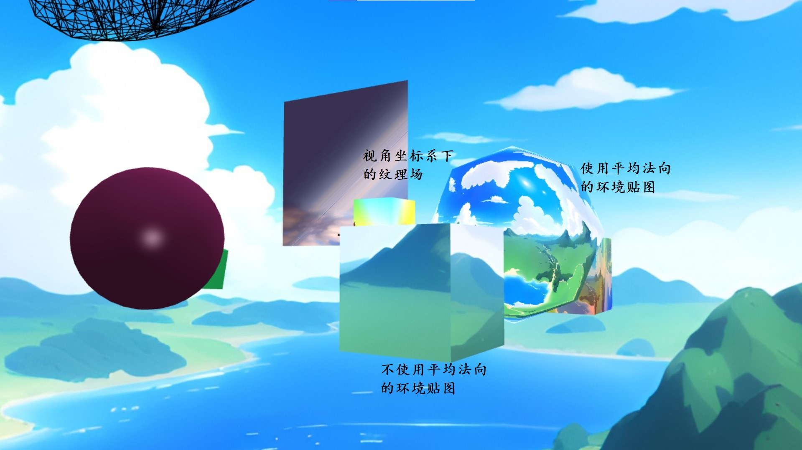

# 计算机图形学课程总结
## 前言·个人总结
&emsp;&emsp;毫不夸张地说，《计算机图形学》是本学期我最感兴趣的课程。从大一开始，我就已经期待着这门课；而得知本课程使用WebGL，我更是倍感亲切——JavaScript是我目前使用最久、最熟练的编程语言。所以，哪怕本课程不在我的培养方案内，我还是毅然选择了这门课，并且十分认真地对待。于是，我成为了未来技术学院唯一一个选这门课的人，也成了整个学期唯一一直坐前两排的人。<br>
&emsp;&emsp;本课程的讲授还有很大进步空间。其中我感到最遗憾的，是讲授太慢、太拖沓，本课程学的内容不如我预想的多。其次，是概念偏多，而数学推导不够踏实、具体实现蜻蜓点水。不过这个不足被四次实验所弥补。有了课上提供的方向，实验时数学与细节自行找资料学习了。最后，是研讨形式过于单一，只有老师与汇报人的互动，组别之间几乎绝缘。老师可以增加一些鼓励措施。<br>
&emsp;&emsp;本课程最大的含金量在于实验。我对自己代码的要求是：自己造轮子、写出可以给别人用的库。对于本课程，我的看齐目标是Three.js。所以，从第一次实验开始，我就致力于完善一个系统。每次实验，最困难的往往不是实现新学的技术，而是如何拓展当前的系统。我希望尽可能做到解耦与模块化，这将影响系统的可维护性与可拓展性。“构建系统”的思想贯穿四次实验，可以从下面的实验报告中窥得一二。此外，我没有用任何外部库，所有代码全部原创；我的代码中留有许多注释，实验234都留有设计文档(记录于文件夹下的markdown文件)，整个项目都有版本管理（项目地址 https://github.com/madderscientist/codeRoad/blob/main/WebGL ）。因此，我认为我的项目是本班最踏实也是最具有工程性的。<br>
&emsp;&emsp;合作方面，一开始我心中没底，所以选择了组队。现在看来，我需对另一个组员致以万分的歉意。由于我不想错过任何一个技术，所以成组之初约定我们一人写一份实验。但是他似乎事情很多，且整个系统搭建起来后只有我了解每一个细节，加之我对JS使用非常熟练，所以最终几乎所有代码都由我一手写就，只能分配一些与GL无关的任务给组员完成。张家展同学是编程的好手，我很愧疚让他没什么实验参与度和体验感，我也很担心他是否读懂了我的代码、真正掌握了所学。

## 文件结构
```
├─lab1: 实验1
├─lab2: 实验2
├─lab2_LINE: 对于lab2文件夹显示stl不足的解决
├─lab3: 实验3
├─lab4: 实验4
├─gl.js: 被所有实验共用的gl封装类
├─index.html: 学习WebGL、用于调试（与实验无关）
└─README.md: 本文件
```
&emsp;&emsp;注意，存在跨文件夹引用js文件的现象，所以请不要改变文件结构（单独拎一个文件夹出去都是运行不了的！）。实验123双击html即可打开，实验4需要在项目根目录下开端口（比如VScode的LiveServer）才能运行（不能在lab4文件夹下开端口，不然无法获取gl.js）。<br>
&emsp;&emsp;gl.js在每次实验都被迭代升级，如果想知道它在每个实验当时的情况，请去github仓库翻2023/9/20至2023/12/25之间的提交记录。<br>
&emsp;&emsp;实验234文件夹下都有readme文件，是当时的设计思路。以下的实验报告仅仅从宏观角度阐述思路，如对细节有疑惑请阅读各文件夹下的markdown文件。<br>

## 实验一
&emsp;&emsp;编程的基本模式：实现并讨论用WebGL编写基本的三维图形显示程序的程序结构和书写规范。

### 要求
发挥想象力，绘制一只动物（2D），要求：
1. 窗口背景白色，动物至少有两种颜色；
2. 可利用鼠标选取动物全部或某一部分，并拖动
3. 利用键盘实现前进、后退、跳跃等功能
4. 实现菜单功能

### 实现结果
lab1.html：
- W：跳 可多段跳 模拟了重力
- A：后退；D：前进
- S：伸懒腰
- ↑、↓、空格、shift：视野平移
- 三个滑动条：视野旋转
- 点击画布：尾巴旋转
- 鼠标进入画布：>头部旋转
- 拖动画面：平移视图
- 滚轮：缩放
- 特色：非方形画布、数据结构
- 未解决：拾取物体。法一是射线拾取，不会。法二是颜色拾取，但是帧缓冲还在摸索


### 设计思路
&emsp;&emsp;第一次实验，最重要的是初步形成一个系统。<br>
&emsp;&emsp;第一次接触WebGL，只有一个感觉：好烦。明明canvas2D只要创建上下文就能绘制，WebGL却要编写着色器、创建并填充缓冲区、传递参数、设置如何取数据，最后才能绘制。而其中每一个环节都很繁琐，比如传递参数需要先获取位置再用函数赋值。因此，需要封装。<br>
&emsp;&emsp;画一只动物其实很难。画一个物体需要大量的数据支持，若手写不仅繁琐也不好看。于是我瞄准了游戏Minecraft的方块风。不如用多个方块组成一个Minecraft中的动物，而不是一个奇形怪状的物体。在这样的思路下，创建2D和3D的难度相当（在有了基本单元：方块的情况下，只需要关注单元位置，而不必关注每个顶点，因而2D和3D需要考虑的数据量差不多），不如直接写3D。我选择了视觉效果好且易于实现的马。<br>
&emsp;&emsp;首先要有方块，抽象成“物体”类，记录了顶点数据；再将“用方块的数据创建物体”设置成一个函数。这样得到的每个方块的顶点数据一样，要实现位姿、大小不同，需要引入变换矩阵。所以我自学了变换矩阵（颇为艰难）。<br>
&emsp;&emsp;考虑构成“马”的方块位置的时候，每次都要从原点开始偏移、旋转，对于找到“头”和“耳朵”这样位置关系密切的物体的位置十分不友好。“耳朵”应该相对于“头”的位置偏移。所以需要搭建类似Unity模型树一样的结构，承载物体之间的父子关系。<br>
&emsp;&emsp;人机交互，只要用某种方法修改变换矩阵即可。<br>
&emsp;&emsp;选中物体，查找资料后，射线选取难做，可以用颜色拾取。所以每个物体要有独一无二的颜色ID。

### 文件结构
```
└─lab1
    │  gl_obj.js: 封装了网格类、物体类、模型树类
    │  gl_obj_frame.js: 尝试使用帧缓冲，但是失败了。所以没有用
    │  jumper.js: 跳跃管理，模拟重力
    │  lab1.html: 请双击此文件
依赖: gl.js
```

### 实现步骤
1. **封装gl**
&emsp;&emsp;斟酌了很久，放弃了新建类包装gl，而是修改gl的原型对象。具体实现在gl.js中，摘要如下：
```js
class MyGL extends WebGL2RenderingContext {
    static new(canvas) {
        let gl = canvas.getContext('webgl2');
        Object.setPrototypeOf(gl, MyGL.prototype);
    }
}
```
&emsp;&emsp;此类中主要封装了对着色器attribute、uniform赋值操作，通过Proxy设置了set和get方法，可以很简单地用‘.’像访问对象属性一样访问glsl变量，并且存储已经访问过的变量位置，以加速下次访问。值得一提的是，lab1时，我将Proxy绑定在gl上，因此切换着色器时需要清空已保存的变量位置。在lab123中并没什么问题，但在lab4我设计了多着色器方案，需要频繁切换着色器，重置缓存十分影响性能。因此lab4将Proxy绑定在编译好的着色器上。当然，lab4的改动向前兼容，不影响lab123。<br>
2. **父子系统**
&emsp;&emsp;即模型树。每个物体都是子树，而树根我抽象成了“世界”，类似Three.js的scene。物体类命名为GLobj，世界类命名为GLobjRoot，都有children属性存储父子关系。children用“字典”的形式组织子物体（而非数组），便于后续找到某个节点。<br>
&emsp;&emsp;父子结构的关键在于解决变换矩阵。子物体的世界变换矩阵，是其相对父物体的变换和父物体的世界变幻的组合。其中矩阵左乘右乘关系尝试了很久，最后得出结论：先在父物体参考系下变换自己，再施加父物体变换，即父物体世界变幻矩阵在最左边。此外，子物体不一定有顶点数据要绘制，可以只表示一个坐标变换。<br>
&emsp;&emsp;绘制的时候要遍历，遍历树有深度优先和广度优先，由于需要传递父物体的变换矩阵，我选择了深度优先递归。每次绘制由GLobjRoot.draw启动其子物体的绘制GLobj.draw，子物体先计算自己的世界变幻矩阵，绘制完成自己后，将自己的世界变换矩阵传递给子子物体，启动子子物体的绘制。<br>
3. **方块**
&emsp;&emsp;网格类GLmesh封装了顶点数据、颜色数据、顶点顺序，以供drawElements绘制。lab1对WebGL的理解还不够深刻，每次绘制都重新创建缓冲区并填充。static cube函数封装了立方体数据,static cubetest函数封装了彩色渐变立方体数据。<br>
&emsp;&emsp;三个类的实际使用示范如下，其中n函数完成了像素到归一化坐标的映射。
```js
GLroot.addChild('body',     // 根节点，世界
    new GLobj(              // 物体
        GLroot.gl,
        GLobj.translation(0),   // 设置位移
        GLobj.rotation(0),      // 设置旋转
        GLmesh.cubetest(),  // 网格
        GLobj.scale(n(380), n(165), n(165)) // 设置大小
    )
);
```
&emsp;&emsp;经过位置设计，多个GLobj组合成了马。<br>
4. **颜色拾取**
&emsp;&emsp;GLmesh实例化时会自动分配唯一的颜色ID。颜色拾取需要重新按新的颜色绘制，但是不能显示出来，经了解，要用frame缓冲，相关尝试在gl_obj_frame.js中，但是没用起来。后续实验保留了颜色ID，但是一直没有实现帧缓冲绘图。<br>
5. **人机交互**
&emsp;&emsp;在没有“拾取”功能的前提下，只能让某个物体跟随运动了，比如关节运动。为了实现“绕某点旋转”，我按自己的理解“搬过去，旋转，搬回去”成功实现尾巴、头、腿关节的旋转。在父子系统的帮助下，让马低头，只要设置头的父节点：脖子的旋转就行。鼠标、键盘、菜单都是简单的前端操作，不展开。<br>
6. **原始的相机思维**
&emsp;&emsp;此外，GLobjRoot还负责着色器管理、相机管理等，在启动子物体递归绘制前，负责设置世界参数等工作。相机有两个作用：一是修正画面。本实验使用了非方形画布，因此需要压缩x轴。二是变换观察方向，但是此处相机只相当于世界的变换矩阵。由于相机的实现非常朴素，导致“单位”的概念无法建立，所有的坐标仍然从归一化坐标的角度出发。lab1使用画布的短边长度作为标准，实现像素到归一化坐标的转换。<br>


## 实验二
&emsp;&emsp;几何对象与变换应用实例：在实验中体现课堂讲授的几何对象与变换的内容，理解基本变换和复合变换。

### 要求
&emsp;&emsp;将动物拓展为三维物体。自由设计交互方式，利用变换实现动物在三维空间中的运动：
1. 实现基于物体坐标系的运动，即动物头部方向为前进，相反方向为后退，绕动物中轴线的转向、俯仰和翻滚。
2. 实现以屏幕坐标为参考的运动，即上、下、左、右移动，和绕屏幕坐标轴的旋转。
3. 利用虚拟跟踪球技术，实现鼠标交互操作旋转查看对象。

### 实现结果
功能：
- 鼠标中键->绕屏幕中心的旋转。按shift以绕x、y轴
- 鼠标右键->在屏幕内平移。按shift以沿x、y轴
- 鼠标左键->绕屏幕z轴旋转
- 鼠标滚轮->缩放
- wasd->马的第一视角运动
- 上下左右 pageup pagedn->马的翻滚

相比于lab1：
- 实现了stl的读取、优化了执行流程、更新了文件结构。
- 实现了虚拟跟踪球！还有绕z轴旋转的跟踪。
- 不足：以鼠标位置进行滚轮缩放失败（所以只有中心缩放）。
- 拓展：在lab2_LINE文件夹的程序中给stl加上了线框




### 设计思路
&emsp;&emsp;前面两点在lab1已经实现（包括对变换的掌握），因此本次实验关注虚拟跟踪球。我的看齐目标是solidworks，想实现3维物体观察的效果。虚拟跟踪球有两种效果：一是solidworks中，在上一刻的基础上变换；二是PPT中，以点击前的状态为基础变换。如果鼠标画圈圈时物体不是周期性变换，那就是前者。前者的逻辑简单些，所以用前者。<br>
&emsp;&emsp;交互方面，为了获得更好的展示效果，我需要模拟solidworks的鼠标使用对物体进行变换。此部分较为简单（不会在实现步骤中论述），从实现结果中可以看出，我支持了左键、中键、右键、滚轮、shift，尽力去还原solidworks的使用。<br>
&emsp;&emsp;在完成了实验要求后（文件夹lab2），我觉得光看一个马没什么意思，所以想加入stl的模型数据。实现之后，由于没有光照，整个stl是一个颜色，只能分辨出轮廓。基于当前所学，我决定给物体加上线框。如果用LINES方法绘制，需要需要重组数据，一个物体两套顶点数据实在不够优雅。我选择使用“重心法”在片元着色器中实现线框，相关成果在lab2_LINE文件夹下（还未实现多着色器支持，所以另开项目）。<br>

### 文件结构
```
└─lab2
    │  gl_obj.js: 封装了物体类、模型树类
    │  lab2.html: 请双击此文件
    |  horse.js：提取了马的创建
    |  mesh.js：封装了网格类
    |  jumper.js：设计思路

└─lab2_LINE
    │  gl_obj.js: 封装了物体类、模型树类
    │  lab2.html: 请双击此文件
    |  mesh.js：封装了网格类
    |  安柏.stl：程序使用的stl文件
    |  README.md：设计思路，包括stl读取和线框显示
依赖: gl.js
```

### 实现步骤
1. **虚拟跟踪球**
&emsp;&emsp;在“查看3维物体”的目标下，虚拟跟踪球解决视角的旋转而不是物体的旋转。在类VirtualTrackingBall中，我封装了两个方法：
- MapToSphere([X, Y])：将平面上的点(X, Y)映射到球面(X, Y, Z)上;
- trackBallRot([X1, Y1, Z1], [X2, Y2, Z2])：将球面上(X1, Y1, Z1)到(X2, Y2, Z2)的运动转变为物体的变换矩阵。

```js
const tb = new VirtualTrackingBall(CANVAS);
// mousemove事件中
if (e.buttons == 4) {   // 中键旋转
    // current position
    let c = tb.MapToSphere([e.offsetX, e.offsetY]);
    // last position（考虑了缩放对移动的影响，和unity学的）
    let l = tb.MapToSphere([e.offsetX - movementX / scalex, e.offsetY - movementY / scaley]);
    // 得到视角如何变化
    let r = VirtualTrackingBall.trackBallRot(l, c);
    camera_r = MultiMat4(r, camera_r);     // camera_r为世界旋转矩阵
}
```
&emsp;&emsp;小难点在于trackBallRot的数学推导。这是一个绕某过原点的轴的转动，需要先将轴对齐到z轴，再以前后两点的夹角进行旋转，再将轴从z轴移回去。如何获取每次旋转的角度是关键。<br>

2. **读取stl文件**
&emsp;&emsp;stl是二进制文件，以面为单元存储，因此我第一反应是用drawArrays绘制。这和当下使用的drawElements是两个体系，所以我将两种绘制方式基于的数据定义为两个类GLmesh_A和GLmesh_E，抽象出父类GLmesh，用继承的方式统一。在GLobj.draw中，根据mesh的类别选择绘制模式。（在lab3中，此处理方式被淘汰，全部统一为用drawElements方式存储与绘制）于是读取stl就非常简单：按顺序将顶点数据写入数组即可。<br>

3. **画线框**
&emsp;&emsp;使用三角重心法，基本原理是将每个三角形中的三个点视为向量基底，其中每个点都可以用这三个向量的线性组合表示（由于三角形是凸的，所以系数都是正数且和为1），根据分量的大小可以决定点与边的距离，进而决定是否是“线”。具体实现的时候，给三个顶点设置参数(1,0,0)(0,1,0)(0,0,1)，利用varying的插值，在片元着色器得到的值就是该点的“坐标”。如果任意一个分量小于某个正数，就代表它靠近边线，用线的颜色绘制。使用该方法的着色器在[/lab2_LINE/gl_obj.js](./lab2_LINE/gl_obj.js)中。细节与详细思路记录在[/lab2_LINE/README.md](./lab2_LINE/README.md)中，比如三个基底参数如何传递。


## 实验三
&emsp;&emsp;场景漫游与光照：掌握视点设置和光照的基本原理、实现方式，并讨论实验效果与参数设置的关系。

### 要求
1. 场景中对象不少于两个，其中至少一个可以自由移动
2. 交互式的视点变化，实现场景漫游
3. 实现光照效果，光源位置绑定在移动物体上，参数可调
4. 场景中至少包含两种以上的材质

### 实现结果
**看得见的：**
- 没有进入全屏模式时，右击可以选一个模型放置，可以选目录下的“安柏.stl”。默认陶瓷质感。
- 左击进入全屏后，模拟常见3d游戏操作实现第一人称漫游：wasd移动，空格shift上下，ctrl加速移动，滚轮修改视窗大小，体现为视角大小。
- “↑↓←→ pageup pagedn”可以控制一个带实体的点光源基于世界坐标系的移动。
- 按键“R G B”可以设置光源的颜色分量+0.02，按住alt键再按则是减法。
**看不见的：**
- 升级数据的存储方式：全面更改类中数据存储形式，使绘制速度更快。统一了数据组织方式，兼容了stl读取。
- 实现动态多光源phong光照效果：光照很容易，动态添加光源对着色器的设计有要求。



### 设计思路
&emsp;&emsp;首先，实现对光照的支持。我决定Phong平滑着色，即基于平均法向，在片元着色器中完成光照计算。为了实现光照，需要引入“材质”的概念。材质中定义了漫反射、镜面反射、环境光反射的参数。此外，我决定在材质中加入颜色的定义，以定义整个物体的颜色。如果不采用这个方法，要实现当前框架下（用attribute和varying传递参数）整体颜色的设置，需要每个顶点传递一样的数据，浪费了内存占用了带宽。在材质中定义颜色，就可以使用uniform只传递一个参数了。此时涉及顶点颜色和材质颜色的混合，我将顶点颜色视为“本色”，透明度为1；而材质颜色视为“喷漆”，透明度可变，两种颜色根据材质颜色的透明度进行混合。<br>
&emsp;&emsp;其次，需要升级数据结构。lab1定义的mesh结构有明显的不足：
- 顶点数据和颜色数据耦合（两个数据在一个Buffer中，设置不同的vertexAttribPointer读取方式）；
- 每次绘制重新生成Buffer，数据传递频繁。
lab2中对stl的支持非常生硬：需要为stl文件专门准备一个类。<br>
&emsp;&emsp;针对以上缺点，需要对mesh类进行统一。目标是，统一用drawElements绘制，而顶点数据在构造函数中就完成Buffer化，这样在绘制时只需要改变ARRAY_BUFFER的指向即可。顶点数据和颜色数据分别用两个buffer存储，并且因为光照引入顶点法向数据。因为有了材质颜色，顶点颜色可以不定义，因此绘制的时候要根据是否有顶点颜色选择是否启用attribute a_color，这要求vertexAttribPointer和enableVertexAttribArray不能在定义着色器的时候就写定，而要在每次绘制的时候决定。据我尝试，如果没有启用attribute，则每次取出来是默认值0。只要设置材质颜色透明度为1即可消除顶点颜色未定义的影响。<br>
&emsp;&emsp;关于stl的读取，要囊括入drawElements的体系，需要对原始数据去重（因为stl按照三角形存储，相邻三角形肯定共用顶点，为了减少数据存储需要合并这些共用的顶点数据）。<br>
&emsp;&emsp;接着，要实现实现动态光源。我惊喜地了解到可以用uniform直接向数组的某位传参。只要在着色器中维护一个光源数组（因为glsl的数组大小固定，所以是最大长度受限的数组，要有长度的指示），渲染的时候根据数组长度一个个完成关照计算即可。光源数据的维护由GLobjRoot类完成，由于光源大多是静态的，因此不设置每次更新传入，而是修改时更新值。<br>
&emsp;&emsp;最后，要引入透视相机。光照着色器需要能访问到相机的位置、位姿矩阵、透视矩阵。由于相机位置改变是经常的，所以在每次绘制的时候更新值。<br>

### 文件结构
```
└─lab1
    |  camera.js：相机类
    │  gl_obj.js: 封装了网格类、物体类、模型树类
    │  lab3.html: 请双击此文件
    |  mat.js：矩阵运算
    |  mesh.js：封装了网格类和材质类
    |  README.md：设计思路
依赖: gl.js
```

### 实现步骤
&emsp;&emsp;思路中提到的“数据结构更新”“光源管理”“光照着色器”“材质定义”已经解释足够详细，此处不提。<br>
1. **读取stl**
&emsp;&emsp;在思路指示下完成GLmesh类数据结构改进和绘制方式的统一后，读取stl需要完成点集的提取；同时为了实现平滑光照，需要同时计算点集中每个顶点的平均法向。流程如下：<br>
&emsp;&emsp;对每个面的每个点，查询已有点集中是否有这个点，如果有，则已有点的法向加上这个面的法向；如果没有，则加入点集，赋予索引，设其法向为当前面的法向。同时维护索引列表。读取完毕，写入glBuffer。如何实现“集合”？我使用stl文件每个点的xyz二进制数据作为点的哈希值，视js对象为“字典”，用哈希表原理构建集合。<br>
&emsp;&emsp;用TRIANGEL模式绘制，需要知道indexBuffer的长度和数据类型。这两个值在读取到stl面数后都可以确定。由于WebGLBuffer不存储这两个属性，因此利用js“基于对象”的特点手动赋予js对象这个属性：indexBuffer.length=面数*3; indexBuffer.type=gl.UNSIGNED_BYTE;<br>

2. **球和自动法向**
&emsp;&emsp;为了突出平滑光照的效果，我决定加入基础形状“球”。球的顶点数据用地球经纬的方式生成，具体实现较为无聊，不提。但球的顶点法向就不好求了。如果用户想自定义网格，肯定也不想自己计算每个点的法向。所以我加入了GLmesh的自动求解法向功能，在构造函数中，如果没有传递法向数据，则自动根据顶点位置和点序号求解。关于法向朝向，要求顶点顺序遵循右手法则（因为不会根据顶点求封闭体内部，尤其是非凸物体）。<br>
&emsp;&emsp;值得一提的是，如果对8个顶点数据定义的立方体用自动法向，每个顶点都是平均法向，光照施加的时候会有凝胶效果，仿佛物体透光。在lab4中定义了用24个顶点位置（一个顶点的数据复制三次，顶点共用只在一个矩形面中发发生）的立方体，才实现棱角分明的立方体<br>

3. **透视相机**
&emsp;&emsp;设计相机类时刻意和其他类解耦，只提供数据，如何使用数据由GLobjRoot类负责。透视矩阵和位姿矩阵推导了我很久很久，一直出bug，最后还是使用了书上现成的公式。一旦定义了相机，就可以定义“单位”了。物体占视野的大小可以由距离控制，因此可以定义物体的高度和宽度超过2，所以干脆定义1的单位为米。我使用的相机模型没有基于视场角，而是使用了“相框大小”，所以需要定义“画布像素”到“米”的转换关系。这个转换关系在相机构造时决定了相框在世界中的大小。<br>

4. **交互**
&emsp;&emsp;为了体现“漫游”，我模仿游戏Minecraft的操作逻辑，定义了鼠标键盘动作；同时使用全屏显示的api，带来更加沉浸的第一人称体验。代码方面，我系统化了交互逻辑。lab3.html中，明确定义了渲染、鼠标动作管理、键盘动作管理、全屏动作管理。<br>

5. **移动光源**
&emsp;&emsp;关于光源和物体的绑定，没有设计数据结构去支持，因此实现方式较为丑陋：
- 设置物体的法向翻转，使之能被内部的光源照亮。
- 光源移动后，按光源的位置设置平移变换矩阵，以更改物体的位置。
- 为了体现光源的颜色，物体的材质中，漫反射调为1，颜色调为纯白。
```js
const lightObj = {
    light: GLroot.addLight(new Pointolite([1, 1, 1], [0, 10, 0])),
    obj: GLroot.addChild('bulb', new GLobj(
        GLroot.gl,
        GLobj.translation(0, 10, 0),
        GLobj.rotation(0),
        GLmesh.cube(GLroot.gl, true),   // 设置法向翻转，这样就可以被里面的光源照亮了
        new GLmaterial(0.1, 1, 0, 20, [1, 1, 1, 1]),  // 漫反射不能不设，不然黑的
        GLobj.scale(0.2, 0.2, 0.2)
    ))
};
// 改变光源颜色
lightObj.light.color.set([r,g,b]);
// 移动光源与绑定物
lightObj.obj.displacement = GLobj.translation(
    lightObj.light.position[0],
    lightObj.light.position[1],
    lightObj.light.position[2]
); GLroot.updateLight(lightObj.light.id);   // 只更新一个
```


## 实验四
&emsp;&emsp;纹理映射： 掌握几种映射方法及WebGL中的纹理映射的设置方法。

### 要求
&emsp;&emsp;实现背景和物体 表面的贴图，实现下面几种效果：
1. 贴图固定在物体表面，随物体变动
2. 纹理场效果
3. 环境贴图效果

### 实现结果
&emsp;&emsp;在lab3的基础上实现了多着色器。每种材质对应一个着色器，着色器在物体添加入场景时自动绑定到物体的材质上（以实现解耦）；修改了底层gl的封装以支持着色器切换。重点是着色器和材质的对应：
- gl和着色器绑定在着色器专用绘制函数中（利用js闭包）；
- 绘制程序绑定着色器程序；
- 着色器程序绑定到material上（添加入场景时自动绑定）；
- material绑定到GLobj上；
- GLobj绑定在GLobjRoot上。

有了系统对多着色器的支持，修改/增加了以下着色器：
1. lab3的光照着色器升级为光照+纹理：兼容了纹理颜色、材质颜色、网格颜色；并增加了obj的读取。obj读取细节：状态机思维、依赖父子结构。
2. 增加了默认着色器：只画线框。（为了增加系统鲁棒性）
3. 增加了环境贴图着色器：映射cubemap的材质。
4. 增加了纹理场着色器：可选参照系。选择物体坐标系，则是空间纹理场。选择视角坐标系，则是视角纹理场。
5. 增加了天空盒着色器：说是盒，其实是平面。也算是视角纹理场。




### 设计思路
&emsp;&emsp;材质、纹理场、环境贴图，明显是三个不同的着色器。因此本实验最重要的是让系统兼容多着色器。学习了Three.js的实现方法，每种材质对应一个着色器，因此需要找到一个办法实现这种对应。<br>
&emsp;&emsp;对于材质，需要考虑三类颜色的兼容：网格上的颜色、材质的颜色、贴图的颜色。前两者的混合同lab3，使用材质颜色的透明度实现混合。最终选择贴图颜色直接与混合后的颜色相乘（后来得知这样的处理与Three.js相同）。<br>
&emsp;&emsp;材质数据从哪来？我选择读取obj文件。需要学习obj的文件结构。<br>
&emsp;&emsp;纹理场的实现其实是自动映射UV坐标。按照书上的说法，只要设置两个平面，实现物体坐标到纹理坐标的映射。关于使用哪个“物体坐标”，需要区分透视投影前和透视投影后。因此，着色器和对应材质要能设置映射模式。<br>
&emsp;&emsp;天空盒的实现有两种：一是真的盒子，纹理绑定在盒子上；二是一个平面，但是纹理随视角的变化而变化。我选了后者。<br>
&emsp;&emsp;对于环境贴图，函数textureCube(u_environment, direction)可以轻松实现纹理映射，关键在于direction的计算。<br>

### 文件结构
```
└─lab4
    │  gl_obj.js：封装了物体类、模型树类，实现了多着色器绑定与绘制
    │  lab4.html：请在根目录开端口打开此文件
    │  material.js：封装了3种材质
    │  mesh.js：封装了网格类，并提供了基本形状的快速创建方法
    │  parseObj.js：解析obj（及其关联的文件）
    │  parseObj.md：学习obj、mtl的文件结构
    │  README.md：设计思路
    │  学习three的架构.md：借鉴Three.js的实现的总结
    │  安柏.mtl：程序中使用的模型
    │  安柏.obj：程序中使用的模型
    │
    ├─skybox：天空盒cubemap
    │  ├─cartoon：卡通风格的天空盒
    │  └─real：现实风格的天空盒
    │
    └─Texture：mtl文件关联的贴图
依赖: gl.js、/lab3/mat.js、/lab3/camera.js
```

### 实现步骤
1. **多着色器支持**
&emsp;&emsp;首先要修改底层gl的封装。在此前的系统中，unifrom和attribute的快捷访问是绑定在gl上的，当时并没有使用多着色器的需求，因此对切换着色器的处理是：清空缓存的变量位置信息。在多着色器的情况下，着色器的切换较为频繁（由于使用父子关系组织物体，因此很难优化以减少着色器的切换，顶多在同一层级对物体排序再渲染），仍然使用这个方案会导致缓存变量位置没有意义（因为渲染一个物体所有传参只用一次），浪费内存和性能。因此，需要将缓存位置从gl改到编译好的着色器程序上。这里，我充分发挥js“基于对象”的特性，将对attribute和uniform的Proxy对象改为当前的着色器；为了让gl仍然可以通过attribute和uniform快捷访问着色器变量，我在useProgram之后，让gl引用了着色器程序的Proxy（见MyGL.useProg）。这样的改动不仅兼容了之前的实验，还让程序结构更为合理。<br>
&emsp;&emsp;其次是材质与着色器的绑定。不同的材质对应不同的着色器，而不同着色器有不同的使用方法，这三者如何绑定与对应需要精心设计（如何在绑定的同时保持较低的耦合度），是本次实验耗时最多的方面。
- **a. 材质与着色器的绑定。** 绘制物体由GLobj.draw负责，着色器在GLobjRoot类中设置，GLobjRoot可以访问GLobj，但GLobj却不能访问GLobjRoot，因此如果要在GLobj.draw中访问到GLobjRoot的着色器，物体应该有着色器程序的引用。不妨让依附于物体的材质对象持有这份引用；而材质类与GLobjRoot类平行，为了解绑，也为了模块化，不能选择在材质类定义中绑定，而应该动态绑定。我找到了关联两者的重要步骤：GLobjRoot.addChild：将包含有材质的物体加入模型树。所以我在GLobjRoot.addChild中对所加入的物体遍历，按照类别设置每一个材质的program属性为对应着色器的引用。
- **b. 着色器使用程序的绑定。** 一开始，我试图在GLobj.draw中根据着色器的类别用不同的赋值、绘制方法。但这样会导致GLobj.draw定义非常臃肿，且将GLobj类和GLobjRoot类耦合。我也尝试将所有着色器的使用抽象出共性，在绑定着色器的时候用一些字符串指导如何赋值，将着色器的使用规范化、序列化，但是我发现共性将限制着色器的设计。以上的思路共性在于仍然由GLobj负责使用GLobjRoot定义的着色器绘制，耦合与限制在所难免。深思熟虑之后，我最终决定将绘制交由着色器对象完成，绘制程序与着色器同时定义，并直接设置为着色器对象的属性，GLobj.draw只要负责调用材质中的着色器的绘制程序即可。这里，我发挥了js“基于对象”和“闭包”的特性，前者完成了绘制函数与着色器的绑定，后者完成了绘制函数对着色器与gl的绑定，这点非常重要，是实现解耦的重点，让绘制程序在GLobjRoot之外也能操作gl。于是GLobj的构造不再需要gl，进一步实现了与GLobjRoot的解耦。
&emsp;&emsp;剩下一个问题：绘制程序需要哪些参数？我回顾了GLobj类的初心：父子关系。因此GLobj类提供了父物体的变换矩阵。所以决定了传参为：mesh、material、transfrom。<br>
基于多着色器系统，创建一个着色器需要以下操作：
1. 新建材质类
2. 在GLobjRoot中新增着色器生成函数，要求返回编译好的着色器对象，其draw属性完成绘制，传参为{mesh, material, translation}
3. 在GLobjRoot.iniGL中调用新的着色器生成函数并保存至GLobjRoot.programs['新着色器名']
4. 在GLobjRoot.setMaterialProgram中关联两者：if(material instanceof 新材质类名) material.program = this.programs['新着色器名'];
<br>

2. **着色器设计**
- 光照纹理材质。在lab3的光照模型上，引入纹理采样器，设置好混合方式即可。材质更名为PhongMaterial，增加了纹理属性。为了支持纹理，网格类增加了纹理映射属性，static函数创建的基本形状增加了具体的纹理映射数据。
- 纹理场。需要uv坐标的片面映射，所以材质类中保存两个平面的参数方程。着色器中的映射坐标由平面方程和片元坐标点乘得到。
- 天空盒。也是一种纹理场，设置一个固定在视野中的、置于最后的平面，其纹理映射由相机视角决定。注意这里不需要相机的位移信息，如果带了位移信息效果非常奇怪。
- 环境贴图。在函数textureCube(u_environment, direction)的帮助下非常容易，不细说。
<br>

3. **obj文件的读取**
&emsp;&emsp;纹理映射当然不能自己写，我第一时间想到了obj文件的读取。解析obj是我本实验做的第一件事，目的是了解成熟的建模软件是如何使用纹理的；这也让我决定了“纹理和材质绑定、材质和着色器绑定”的方案（初期决定的是物体与纹理绑定）。<br>
&emsp;&emsp;读取obj的难点在于数据重组（一个obj有多重纹理多个贴图，材质也可能重复出现），还需要考虑数据复用等方面。最终决定以mtl为单位聚合数据形成多个不同材质的物体，多个物体用父子系统实现整合。读取obj使用状态机思维，此处不赘述，在[/lab4/README.md](./lab4/README.md)中有详细的记录。


报告中省略了很多细节与斟酌，如要获取更多设计考虑，请去各文件夹下的markdown文件查看。