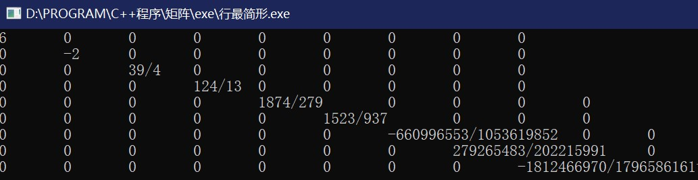
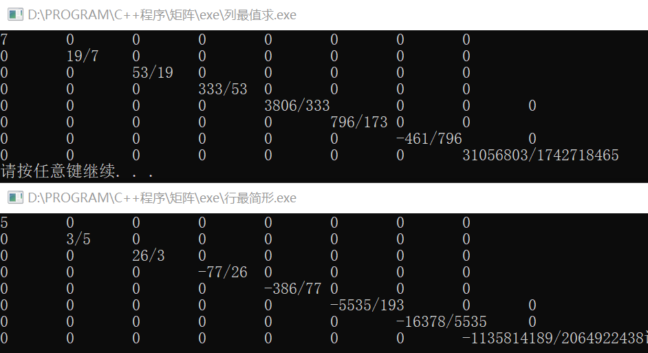
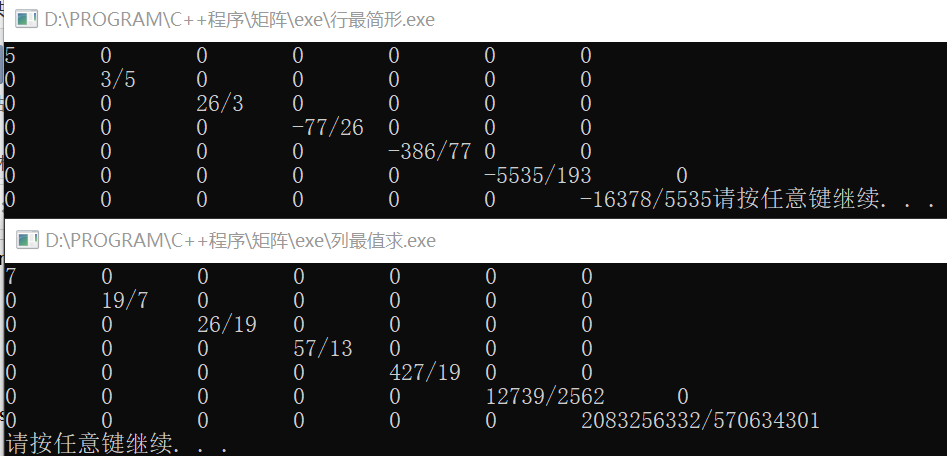
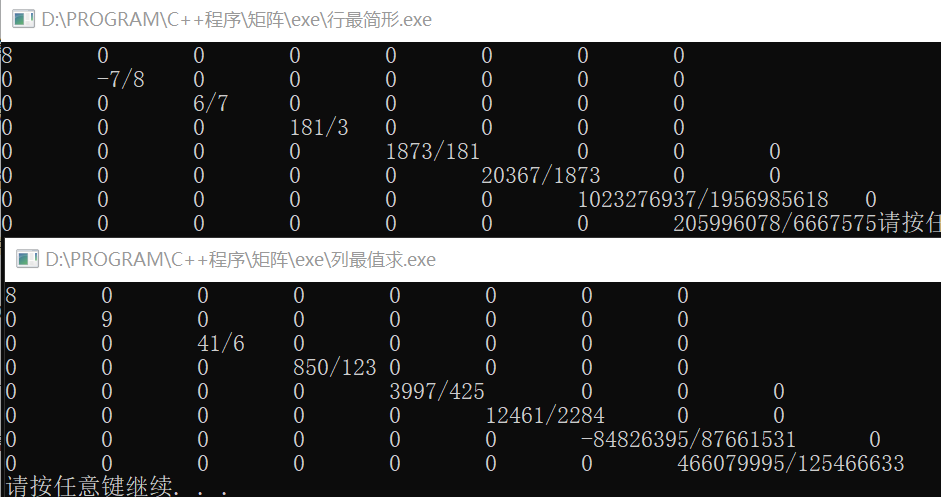
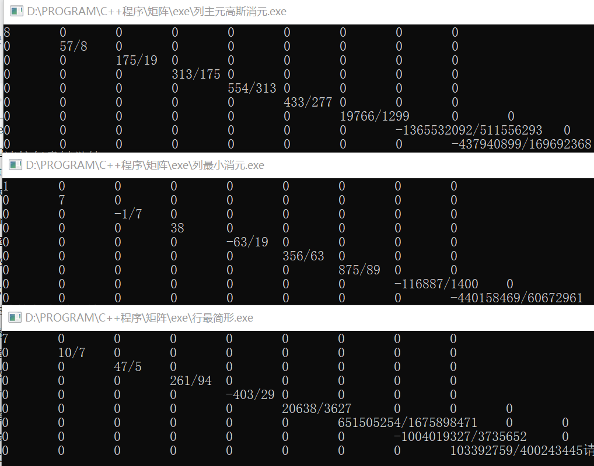
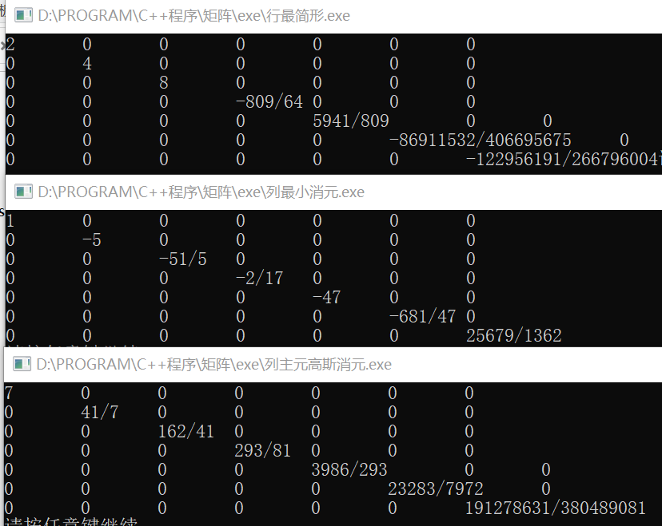
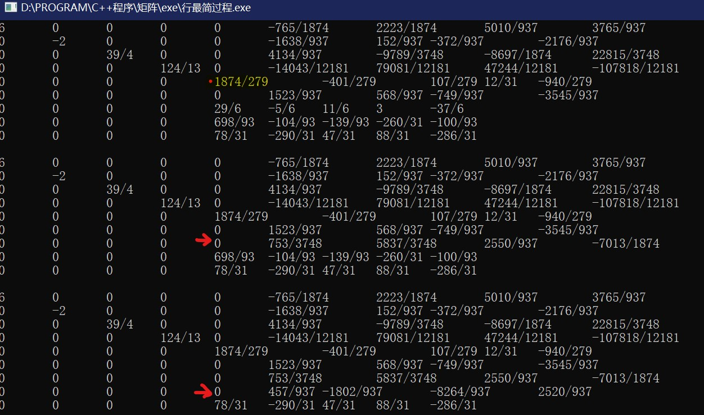

# 分数矩阵
早期C++学习的练习

- 创建时间：2021年12月19日，16:53:16
- 目的：完成自己的分数类和矩阵类
- 思路：中规中矩的矩阵运算和分数运算，全部按照定义
- exe中是一套矩阵运算可执行程序，挨个运行就好了
- 附上当时的疑问，后来也没想下去：

期中考试之后，有交大的同学向我展示他们的线代编程作业，有一部分是求23阶矩阵的行列式。一开始用拉普拉斯展开算，但是23阶根本算不动；最后改为高斯消元（成果如下：） 
	https://suck.rth1.me/matrix.html 
    但是，我总觉得结果太粗糙，于是想做用分数表示结果。因为javascript没有“类”的概念，我改用C++实现，编写了一个分数类，并在此基础上做了分数矩阵类。但是，高斯消元的时候，大概7阶开始，分子分母就会溢出。分数类我使用int型做分子分母，主要考虑到矩阵元素众多，想省内存。但是因此数据就会很容易溢出。(如下图) 
    
    解决方法有2：制作超大整数类，和优化算法。毫无疑问选择第二个。现在的消元算法是按照矩阵给的样子消元，除了遇到首元为0才会进行换行操作，其余都是倍加消元。昨天（12.24日）了解到“列主元消元法”（如下图），即每次消元用该列最大的元素消别的元素。 
    
    
    我信了他的鬼话，结果溢出更严重了：（主要是看第二张图，原算法没溢出新算法已经溢出了）（对同一个矩阵操作）(列最值就是新换的算法) 
    
    ------------
    
    ------------
    
    一气之下我改了个“列最小元消元法”，用每一列绝对值最小的非零元消元，结果竟然出乎意料得好： 
    
    ------------
    
    但我觉得还是有优化的空间。问题来了： 
    如何选择，使消元的的结果，分子分母的位数尽可能小？ 
    附图：消元过程。正在用黄底的那一行对下面两行消元 
    