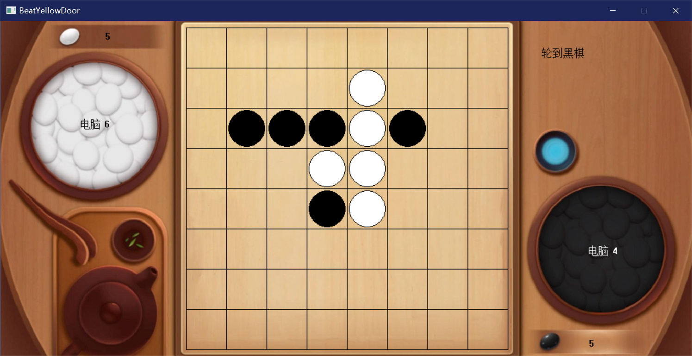

# 黑白棋
可以人人对战、人机、机机

- 创建时间：2022年1月13日，寒假的项目，第一次合作。
- 起因：有个外号"黄门"的高中同学擅长打黑白棋，于是我和另一个[高中同学](https://space.bilibili.com/174819631/)写了这个游戏来挑战他。我负责ui和下棋实现，他负责ai算法。
- 思路：算法是红黑树剪枝，因为这个游戏边界很重要，所以给边角更大的权值，让ai优先占领。ai难度的2468指往后预测多少步。ui主要是监测按钮，用easyx挺麻烦的，写了个按钮类，按钮列表类，每次点击就遍历以获取点击的按钮，再调用它对应的函数。游戏的基本实现主要是往八个方向搜索。
- 使用：可以配置ai的权值。具体看代码。还可以记录每次的走棋。游戏在：BeatYellowDoor\x64\Debug\BeatYellowDoor.exe
- 反思：现在看来这个项目的构架一塌糊涂。主要是游戏流程控制方面很混乱。easyx实在基础，不适合做应用（适合画图），所以做应用转向了Qt。

release编译不了，debug可以。现在想来估计是我屎山ui导致的内存问题。 
截图(电脑互殴)：

写的 easyx ui 也一并附上（easyx组件类）。